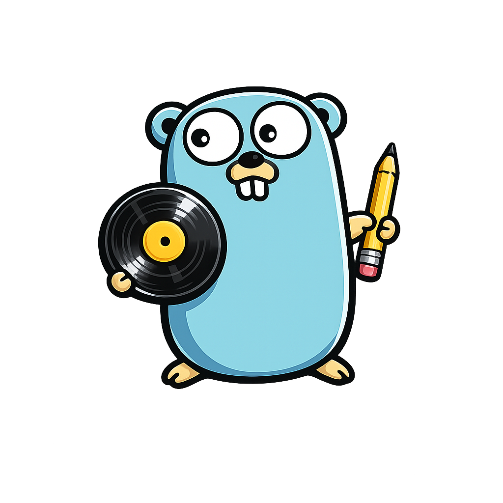

<p align="center">
  
</p>

# Scrobblet


[](https://goreportcard.com/report/github.com/degeens/scrobblet)
[](https://github.com/degeens/scrobblet/releases)
[](LICENSE)
[](https://hub.docker.com/r/degeens/scrobblet)

Scrobblet is a lightweight scrobbler for self-hosters. It tracks your listening activity from a music source and scrobbles it to your preferred target, and is easily extensible with new integrations.

Currently, Scrobblet supports **Spotify** as a source and can scrobble to **Last.fm**, **ListenBrainz**, **Maloja**, **Koito**, or **CSV**. More sources and targets can be easily added. Feel free to [create a pull request](https://github.com/degeens/scrobblet/pulls) with your implementation or [open an issue](https://github.com/degeens/scrobblet/issues) to request a new integration.

> **⚠️ Warning**: This project is in early stages of development. Features and APIs may change without notice.

## Getting Started

Create a `docker-compose.yml` file with your configuration:

```yaml
services:
  scrobblet:
    container_name: scrobblet
    image: degeens/scrobblet:latest
    volumes:
      - scrobblet-data:/etc/scrobblet
    ports:
      - 7276:7276
    environment:
      - SCROBBLET_PORT=7276
      - SCROBBLET_DATA_PATH=/etc/scrobblet
      - SCROBBLET_SOURCE=Spotify
      - SCROBBLET_TARGET=Koito
      # Spotify (Required when SCROBBLET_SOURCE=Spotify)
      - SPOTIFY_CLIENT_ID=your_spotify_client_id
      - SPOTIFY_CLIENT_SECRET=your_spotify_client_secret
      - SPOTIFY_REDIRECT_URL=http://127.0.0.1:7276/spotify/callback
      # Last.fm (Required when SCROBBLET_TARGET=LastFm)
      - LASTFM_API_KEY=your_lastfm_api_key
      - LASTFM_SHARED_SECRET=your_lastfm_shared_secret
      - LASTFM_REDIRECT_URL=http://127.0.0.1:7276/lastfm/callback
      # ListenBrainz (Required when SCROBBLET_TARGET=ListenBrainz)
      - LISTENBRAINZ_TOKEN=your_listenbrainz_token
      # Maloja (Required when SCROBBLET_TARGET=Maloja)
      - MALOJA_URL=your_maloja_url
      - MALOJA_TOKEN=your_maloja_token
      # Koito (Required when SCROBBLET_TARGET=Koito)
      - KOITO_URL=your_koito_url
      - KOITO_TOKEN=your_koito_token
      # CSV (Optional when SCROBBLET_TARGET=CSV)
      - CSV_FILE_PATH=/etc/scrobblet/scrobbles.csv
    restart: unless-stopped
volumes:
  scrobblet-data:
```

Start the service with `docker-compose up -d`.

## Configuration

For detailed configuration instructions, see the [Configuration Guide](docs/configuration.md).

## License

This project is licensed under the GNU General Public License v3.0. See the [LICENSE](LICENSE) file for details.
